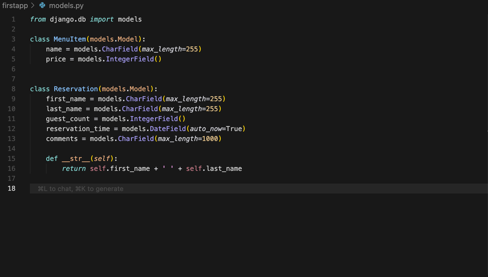
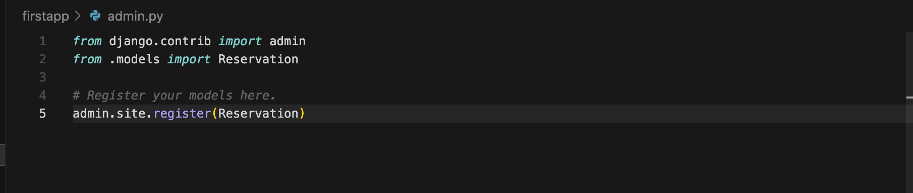

<h3>how to Install </h3>

<h4>Make sure you run the below command to install necessary library</h4>
<h5><pre><code>pip install -r requirements.txt</code></pre></h5>

<table width="100%" style="width: 100%">
    <tr>
        <th></th>
        <th width="95%">Title/Information</th>
    </tr>
    <tr>
        <td>1</td>
        <td>
             <pre><code>
             pip install requirements.txt
             </code></pre>
        </td>
    </tr>
    <tr>
        <td>2</td>
        <td>
            <pre><code>
             django-admin --version
             </code></pre>
        </td>
    </tr>
    <tr>
        <td>3</td>
        <td>
             <pre><code>
             django-admin startproject myproject
             cd myproject
             </code></pre>
        </td>
    </tr>
    <tr>
        <td>4</td>
        <td>
             <pre><code>   
             python manage.py runserver
             </code></pre>
        </td>
    </tr>
    <tr>
        <td>5</td>
        <td>
            To Create user for admin panel, accessible through http://127.0.0.1:8000/admin/
             <pre><code>
             python manage.py createsuperuser
             </code></pre>
        </td>
    </tr>
    <tr>
        <td>6</td>
        <td>
            To Create App
             <pre><code>   
             python manage.py startapp firstapp
             </code></pre>
        </td>
    </tr>
     <tr>
        <td>7</td>
        <td>
            in root urls.py
            <pre><code>
            from firstapp.views import home  
            </code></pre> 
            <pre><code>
                urlpatterns = [
                        path('app/', include('firstapp.urls')),
                    ]
            </code></pre> 
        </td>
    </tr>
    <tr>
        <td>8</td>
        <td>
            updating models to migrate
             
        </td>
    </tr>
    <tr>
        <td>9</td>
        <td>
            attaching model to admin panel for Crud features
             
        </td>
    </tr>

    
    

</table>

